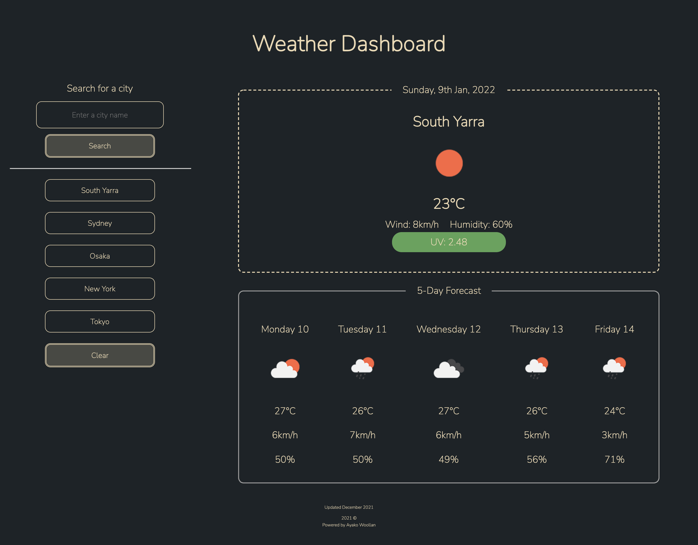

## About
This is a weather dashboard that will run in the browser and feature dynamically updated HTML and CSS.
With this application, the user can see the weather outlook for multiple cities so that they can plan a trip accordingly.

## Instruction
This is a weather dashboard with form inputs.

- When the user searches for a city, 
 current and future conditions for that city will be presented,
 and that city will be added to the search history. (default: Tokyo)

- When the user views current weather conditions for that city,
 the city name, the date, an icon representation of weather conditions, 
 the temperature, the humidity, the wind speed, 
 and the UV index will be presented.

- When the user views the UV index,
 a color that indicates whether the conditions are low, moderate, high,very high or extreme will be presented.

  The UV radiation levels are divided into: 

  * 🟩 Low (0-2)
  * 🟨 Moderate(3-5)
  * 🟧 High (6-7)
  * 🟥 Very high (8-10)
  * 🟪 Extreme (11 and above)

     (Reference: [Cancer Council Australia](https://www.cancer.org.au/cancer-information/causes-and-prevention/sun-safety/uv-index))

- When the user views future weather conditions for that city,
 a 5-day forecast that displays the date, an icon representation of weather conditions, the temperature, the wind speed, and the humidity will be presented.
 
- When the user clicks on a city in the search history,
 current and future conditions for that city will be presented.

- When the user clicks on the clear button, 
 the search history will be deleted from the screen and the local storage.

## Product
[Click here for the GitHub Page](https://ayacomputer.github.io/06-Weather-Dashboard/)

